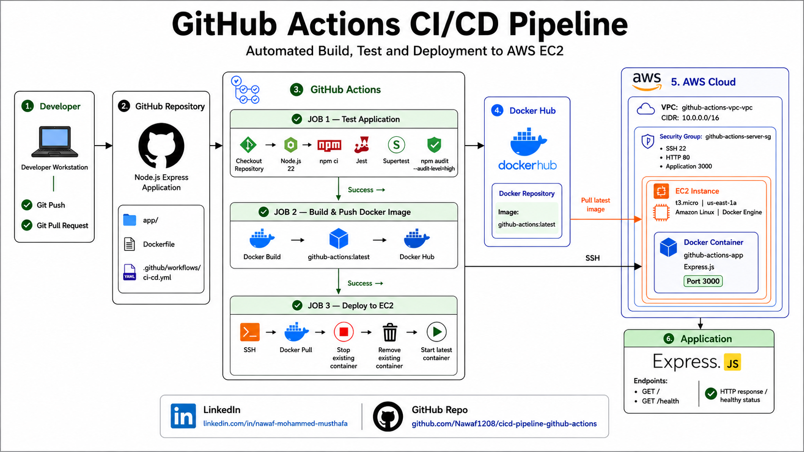
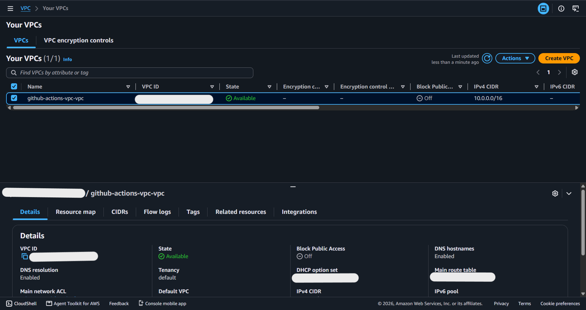
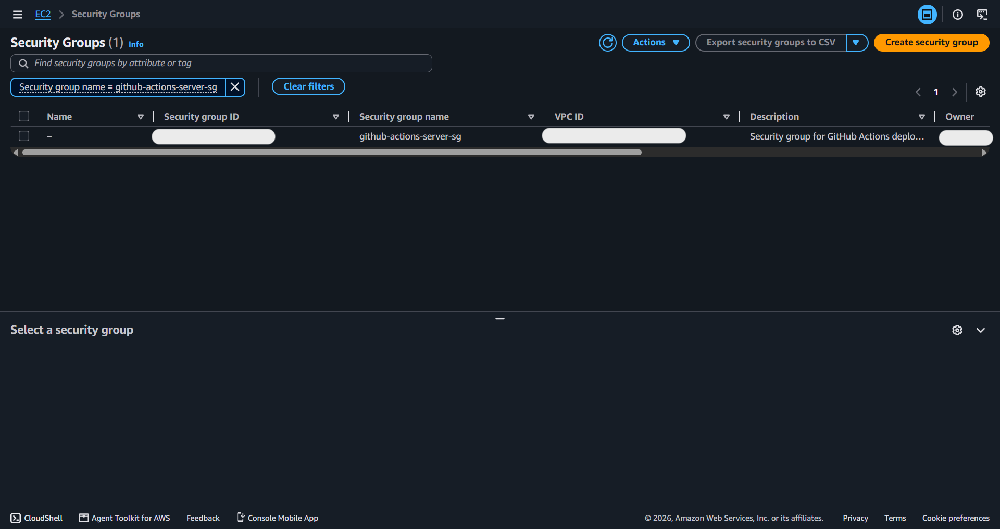
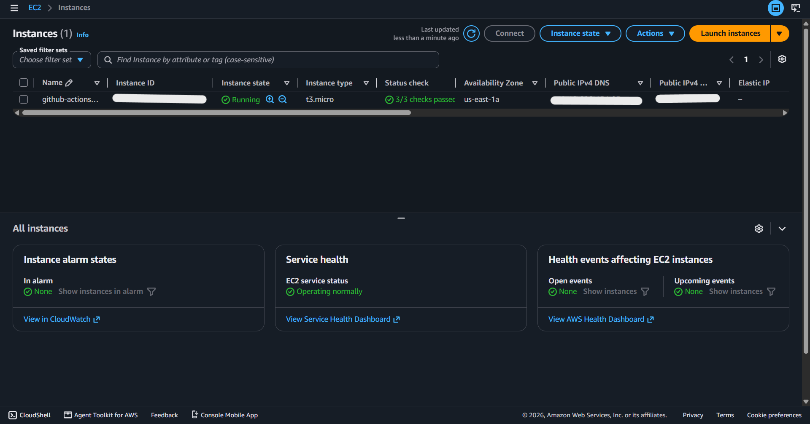

# GitHub Actions CI/CD Pipeline


A practical CI/CD pipeline for a small Express.js application using **GitHub Actions**, automated testing, Docker, Docker Hub, and AWS EC2. The pipeline automatically tests the application, performs a security audit, builds and pushes a Docker image, and deploys the latest image to an EC2 server.



# Features

- **Automated Testing**: Runs Jest and Supertest tests for the Express.js application.
- **Security Audit**: Checks project dependencies using `npm audit`.
- **Docker Build**: Builds a Docker image for the application.
- **Docker Hub Publishing**: Pushes the latest Docker image to Docker Hub.
- **AWS EC2 Deployment**: Deploys the Docker image to an EC2 server.
- **SSH Deployment**: Connects to EC2 securely using SSH credentials stored in GitHub Secrets.
- **Automatic Container Replacement**: Stops the previous container and starts the latest version.
- **CI/CD Automation**: Runs the complete workflow automatically after changes are pushed to the `main` branch.

# Project Structure

```text
cicd-pipeline-github-actions/
├── app/
│   ├── app.js
│   ├── server.js
│   ├── app.test.js
│   ├── package.json
│   └── package-lock.json
├── .github/
│   └── workflows/
│       └── ci-cd.yml
├── Dockerfile
├── .dockerignore
├── .gitignore
├── screenshots/
│   ├── VPC.png
│   ├── EC2.png
│   └── SG.png
├── Project-2.png
└── README.md
```

- **app/app.js**: Express.js application and routes.
- **app/server.js**: Starts the Express.js server.
- **app/app.test.js**: Automated tests using Jest and Supertest.
- **.github/workflows/ci-cd.yml**: GitHub Actions CI/CD workflow.
- **Dockerfile**: Defines the Docker image for the application.
- **screenshots/VPC.png**: AWS VPC configuration.
- **screenshots/EC2.png**: AWS EC2 instance configuration.
- **screenshots/SG.png**: AWS Security Group configuration.
- **Project-2.png**: CI/CD architecture diagram.
- **README.md**: Project documentation.

# Getting Started

## Prerequisites

- Node.js
- npm
- Docker
- Git
- AWS account
- Docker Hub account

## Installation

1. Clone the repository:

```bash
git clone https://github.com/Nawaf1208/cicd-pipeline-github-actions.git
```

2. Navigate into the project:

```bash
cd cicd-pipeline-github-actions
```

3. Install application dependencies:

```bash
cd app
npm ci
```

4. Run the tests:

```bash
npm test
```

5. Start the application:

```bash
npm start
```

The application runs on:

```text
http://localhost:3000
```

# Usage

The CI/CD workflow performs the following operations:

```text
Git Push
    │
    ▼
GitHub Actions
    │
    ▼
Run Tests
    │
    ▼
Security Audit
    │
    ▼
Build Docker Image
    │
    ▼
Push to Docker Hub
    │
    ▼
SSH to AWS EC2
    │
    ▼
Pull Latest Image
    │
    ▼
Run Docker Container
```

The application provides:

```text
GET /
GET /health
```

Example health response:

```json
{
  "status": "healthy"
}
```

# Docker

Build the Docker image:

```bash
docker build -t github-actions .
```

Run the container:

```bash
docker run -d   --name github-actions-app   -p 3000:3000   github-actions
```

Verify:

```bash
curl http://localhost:3000/health
```

Check the container:

```bash
docker ps
```

# AWS EC2

The application is deployed to an AWS EC2 instance running Docker.

The EC2 server is configured inside a dedicated VPC and Security Group.

### VPC



### Security Group



### EC2 Instance



# GitHub Actions Secrets

The deployment uses GitHub Actions Secrets for sensitive values:

```text
DOCKER_USERNAME
DOCKER_TOKEN
SERVER_HOST
SERVER_USERNAME
SERVER_SSH_KEY
```

The EC2 public IP is stored in:

```text
SERVER_HOST
```

If the EC2 instance is stopped and started again, its public IP may change. Update `SERVER_HOST` before the next deployment.

# Verification

1. **Run automated tests**

```bash
cd app
npm test
```

2. **Run security audit**

```bash
npm audit --audit-level=high
```

3. **Build Docker image**

```bash
docker build -t github-actions .
```

4. **Verify Docker container**

```bash
docker ps
```

5. **Verify the application**

```bash
curl http://localhost:3000/health
```

6. **Verify EC2 deployment**

```bash
docker ps
docker logs github-actions-app
```

7. **Verify the GitHub Actions workflow**

The workflow should complete successfully through:

```text
Test Application
       ↓
Build and Push Docker Image
       ↓
Deploy to EC2
```

# Cleanup

Stop the Docker container:

```bash
docker stop github-actions-app
```

Remove the container:

```bash
docker rm github-actions-app
```

Stop the EC2 instance when it is no longer required.

If the EC2 instance is started again later, check its new public IP and update:

```text
SERVER_HOST
```

in GitHub Actions Secrets before deploying.
